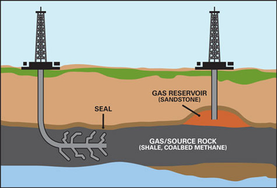

# How Natural Gas is Obtained
Now imagine how to obtain the invisible treasure? That's the challenge face by geologist
when exploring for natural gas. Sometimes there are clues on the earth's surface. An oil
seeps is a possible sign of natural gas below, since oil and gas are sometimes found together.
Geologists also have sensitive machines that can "sniff" surface soil and air for small
amounts of natural gas that may have leaked from below ground.

The search for natural gas begins with geologists who locate the types of rock that are
known to contain gas and oil deposits. Today their tools include seismic surveys that are
used to find the right places to drill wells. Seismic surveys use echoes from a vibration
source at the Earth's surface (usually a vibrating pad under a truck built for this purpose) to
collect information about the rocks beneath. They send sound waves into the ground and
measure how fast the waves bounce back. This tells them how hard and how thick the
different rock layers are underground. The data is fed into a computer, which draws a 
picture of the rock layers. This picture is called a seismogram. Sometimes, it is necessary to
use small amounts of dynamite to provide the vibration that is needed.
The next task are taken by scientists and engineers who explore a chosen area by studying
rock samples from the earth and taking measurements. If the site seems promising, drilling
begins. Some of these areas are on land but many are offshore, deep in the ocean. Once the
gas is found, it flows up through the well to the surface of the ground and into large
pipelines. Some of the gases that are produced along with methane, such as butane and
propane, are separated and the other sour gases such as carbon dioxide and hydrogen
sulfide are cleaned at a gas processing plant (normally called as sweetening process). The
by-products, once removed, are used in a number of ways. For example, propane and
butane can be used for cooking gas.
Because natural gas is colorless, odorless and tasteless, mercaptan (a sulfur-containing
organic compound with the general formula RSH where R is any radical, especially ethyl
mercaptan, C2H5SH) is added before distribution, to give it a distinct unpleasant odor (like
that of rotten eggs). This serves as a safety device by allowing it to be detected in the
atmosphere, in cases where leaks occur.
Most of the natural gas consumed in the United States is produced in the United States.
Some is imported from Canada and shipped to the United States in pipelines. Increasingly
natural gas is also being shipped to the United States as liquefied natural gas (LNG). 

